# ₿ Bitcoin Paper Wallet Generator

```
██████╗ ████████╗ ██████╗    ██████╗  █████╗ ██████╗ ███████╗██████╗
██╔══██╗╚══██╔══╝██╔════╝    ██╔══██╗██╔══██╗██╔══██╗██╔════╝██╔══██╗
██████╔╝   ██║   ██║         ██████╔╝███████║██████╔╝█████╗  ██████╔╝
██╔══██╗   ██║   ██║         ██╔═══╝ ██╔══██║██╔═══╝ ██╔══╝  ██╔══██╗
██████╔╝   ██║   ╚██████╗    ██║     ██║  ██║██║     ███████╗██║  ██║
╚═════╝    ╚═╝    ╚═════╝    ╚═╝     ╚═╝  ╚═╝╚═╝     ╚══════╝╚═╝  ╚═╝
                   OFFLINE  //  ZERO DEPENDENCIES  //  AUDITABLE
```


> **A single-file, zero-dependency, fully offline Bitcoin paper wallet generator.  
> All cryptography runs in your browser. Your keys never leave your machine.**

---

---

## Quick Start

[](https://github.com/Raskollnikov/Paper_Wallet/releases/tag/v1.1.0)

[](https://www.youtube.com/watch?v=xs8KU_F5JaQ&t=869s)

```
the generator is designed to be used in an offline environment only

Recommended workflow:

Download the release
Verify the file integrity
Transfer to an air-gapped machine
Generate wallets offline
Never generate wallets on a machine connected to the internet.

Latest Release

Latest version: v1.1.0

https://github.com/Raskollnikov/Fully-Air-Gapped-Bitcoin-Key-Generator/releases/tag/v1.1.0

SHA256 of index.html:

## 3e5e86fe09cc17731b6fbc86485516918a233fc80773b80191770e494fbe6398

Before using the generator, verify that the file was not modified

Steps:

Transfer airgap-predator-v1.1.0.html to your offline machine

Open a terminal and run:

sha256sum airgap-predator-v1.1.0.html

Expected output:

## 3e5e86fe09cc17731b6fbc86485516918a233fc80773b80191770e494fbe6398

Proceed only if the hash matches exactly

Recommended Environment
For maximum security use:

Recommended setup:

Boot Tails from USB
Disable WiFi and Bluetooth
Do not mount internal disks
Run the generator from the USB drive

Usage:

Boot into Tails or another air-gapped environment
Verify the file integrity using sha256sum
Open the file locally:
file://airgap-predator-v1.1.0.html
Generate wallets

```

## SCREENSHOTS


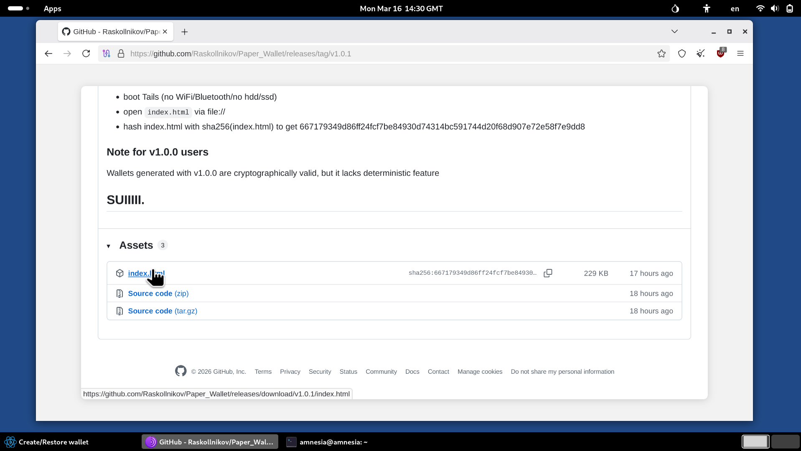
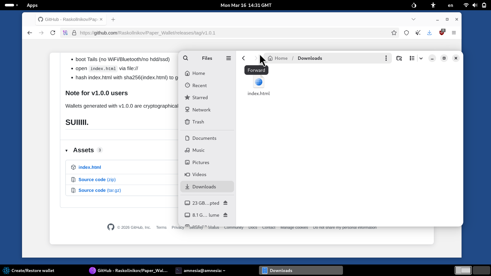
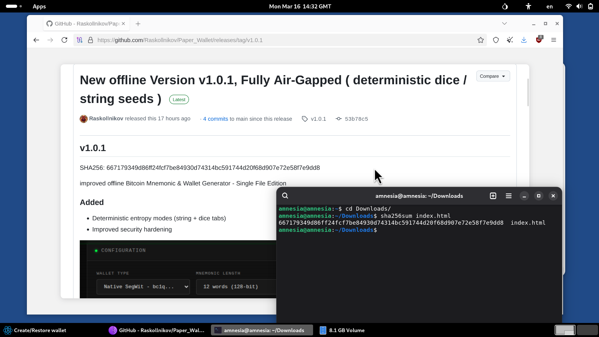

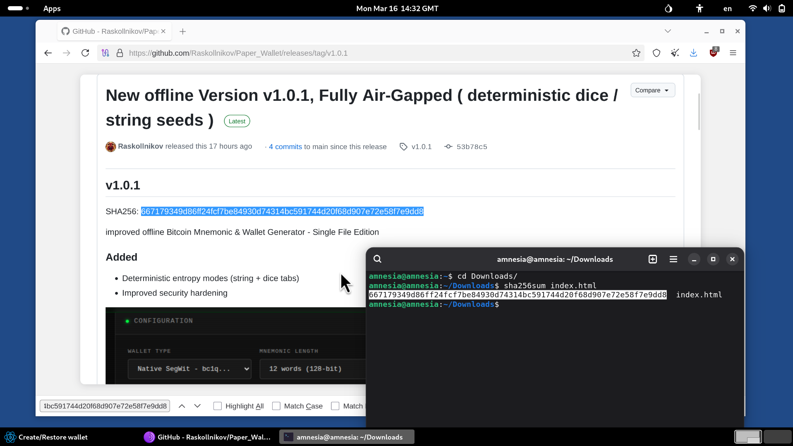
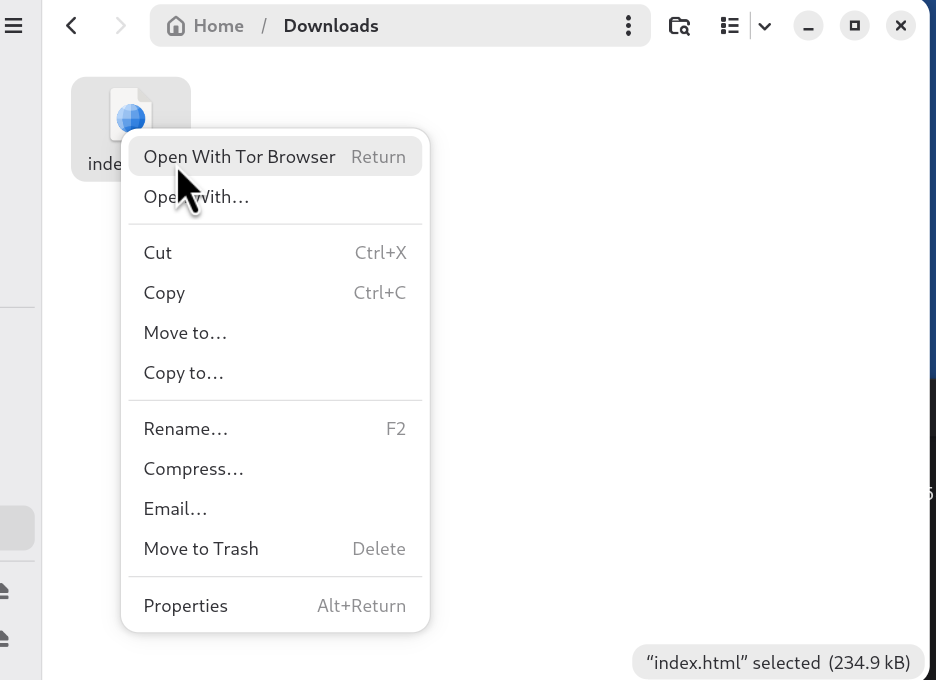
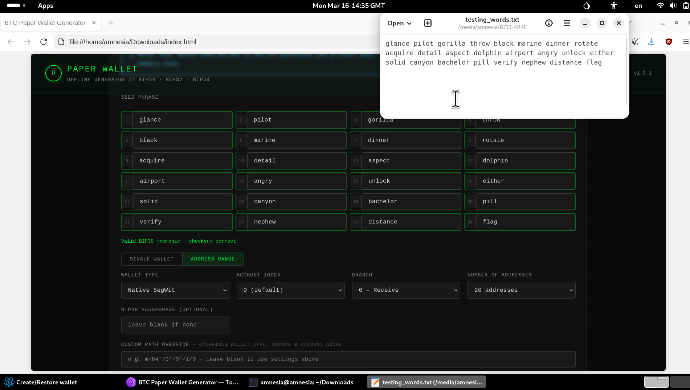
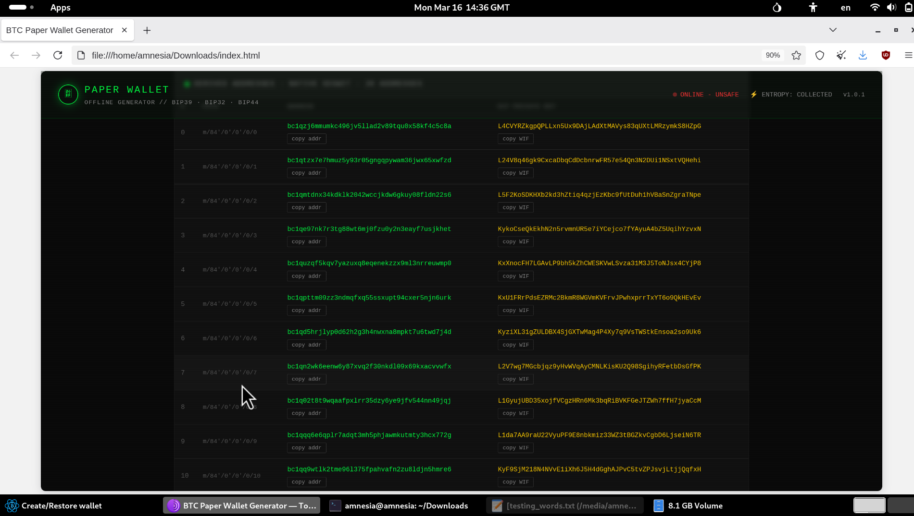
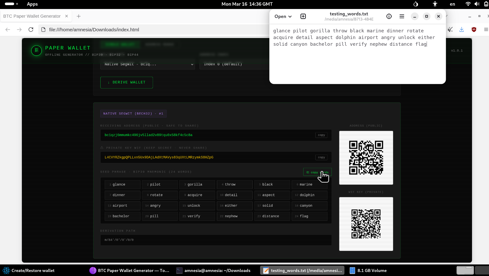
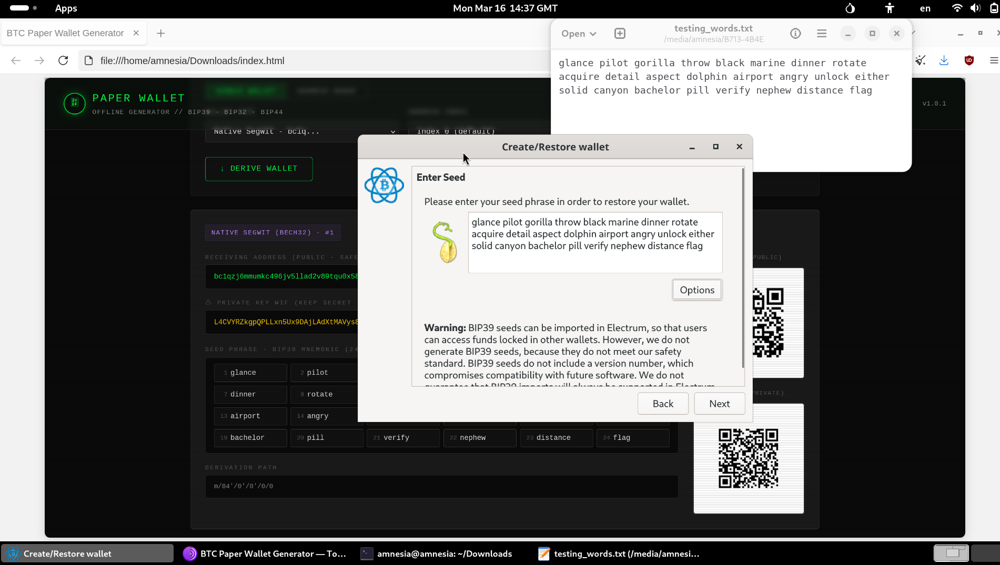
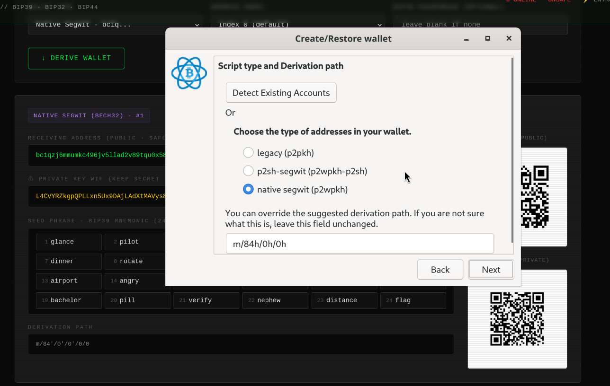
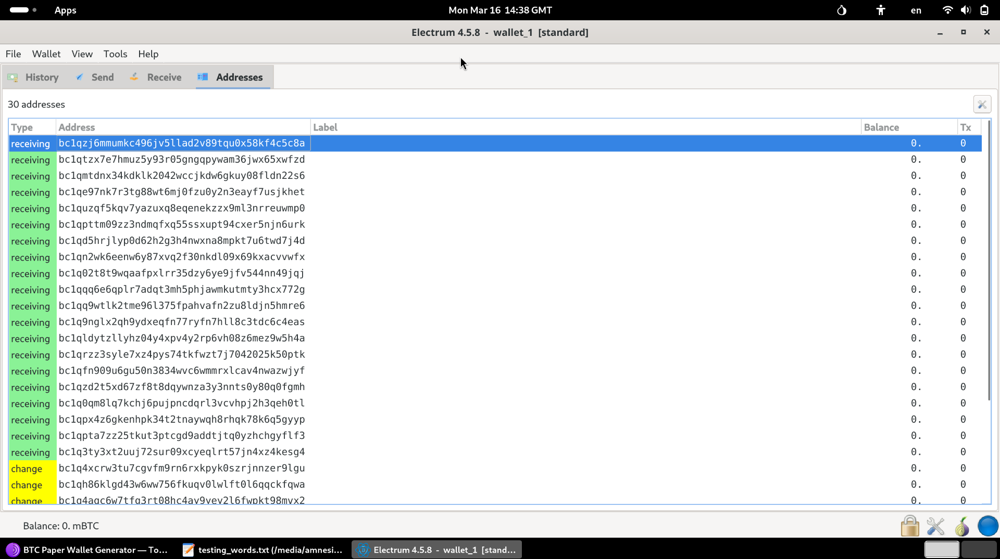

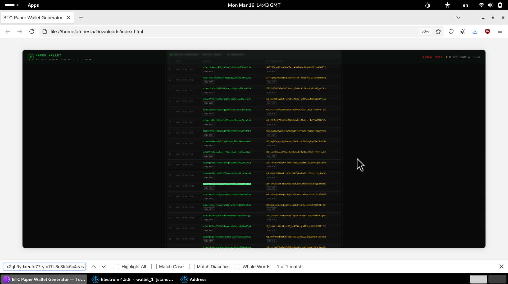
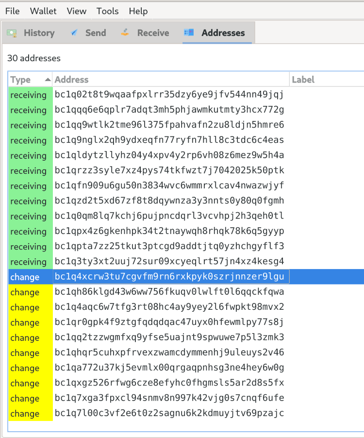
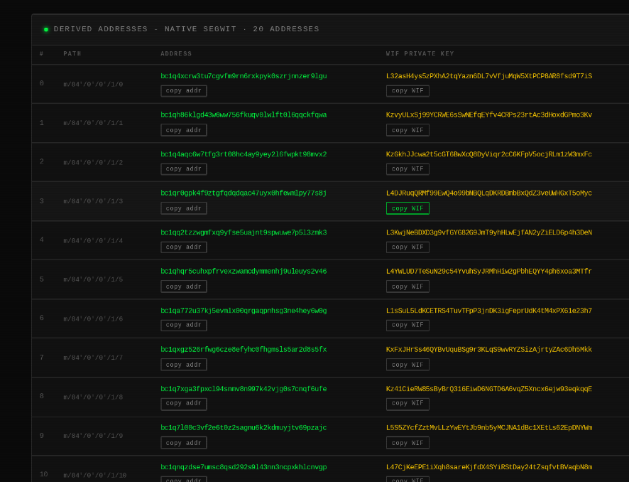


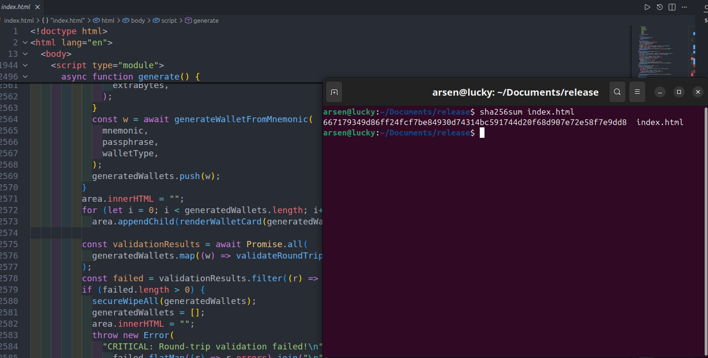


---

## File Structure

```
btc-paper-wallet/ for overal testing
├── index.html <- Open this in your browser - entire UI lives here
├── css/
│ └── style.css <- All UI styling
├── js/
│ ├── wallet.js <- Cryptographic engine (BIP39/32/44/49/84)
│ └── wordlist.js <- 2048 BIP39 English words
├── testing/
│ └── test.js <- Full test suite (Node.js, 58 tests)
└── README.md


```

---

## Security Architecture

### Threat model

| Protected against                                             | Not protected against               |
| ------------------------------------------------------------- | ----------------------------------- |
| Network interception - keys are never transmitted             | Malware already on your machine     |
| Server-side logging - there is no server                      | Compromised browser binary          |
| Weak randomness - uses `crypto.getRandomValues()`             | Physical access to printed wallet   |
| Extension injection - strict CSP blocks all external requests | Screen recording / shoulder surfing |
| CDN supply-chain attacks - zero external dependencies         | Weak or reused BIP39 passphrase     |

### Entropy pipeline

```

crypto.getRandomValues(32 bytes) <- OS-level CSPRNG (primary, always used) +
Mouse movement coordinates <- mixed in via SHA-256
Performance.now() microsecond jitter
│
▼
SHA-256(csprng ‖ mouseEntropy ‖ timestamp)
│
▼
entropyToMnemonic() -> BIP39 mnemonic

```

The CSPRNG alone provides the full 128 or 256 bits required. Mouse entropy is defense-in-depth only - it cannot reduce security below CSPRNG level

### Dice entropy (optional)

```

Physical dice rolls → base-6 bigint → 32 bytes +
Fresh crypto.getRandomValues() +
Per-wallet nonce (walletIndex as 4-byte uint)
│
▼
SHA-256(csrng ‖ diceBytes ‖ index) → entropy

```

Naive 3-bit mapping biases faces 1–2 twice as likely. This implementation uses unbiased base-6 conversion: the full roll sequence is treated as one base-6 number, then converted to bytes. 99 rolls = log₂(6⁹⁹) ≈ 256 bits of entropy.

The `walletIndex` nonce ensures that generating multiple wallets from the same dice string produces provably distinct mnemonics - even if the CSPRNG component somehow repeated.

### String entropy (deterministic)
```
User-supplied string (UTF-8 encoded)
         │
         ▼
SHA-256(UTF-8(string))              <- 32-byte hash, all bytes used
         │
         ▼
First 16 bytes → 12-word mnemonic  (128-bit entropy)
First 32 bytes → 24-word mnemonic  (256-bit entropy)
         │
         ▼
entropyToMnemonic() → BIP39 mnemonic

For batch generation (quantity > 1):
SHA-256(UTF-8(string ‖ \x00 ‖ uint32(walletIndex)))
         │
         ▼
Same pipeline - each wallet index produces a unique, reproducible mnemonic

```

## Dice entropy - deterministic mode

```
Physical dice rolls [1–6] × 50–150
         │
         ▼
Base-6 bigint conversion            <- unbiased: treats full sequence as
n = (r₀-1)·6⁹⁸ + (r₁-1)·6⁹⁷ + …    one large base-6 number, not 3-bit
         │                             mapping (which would bias faces 1-2)
         ▼
32-byte big-endian representation
         │
         ▼
First 16 bytes → 12-word mnemonic
First 32 bytes → 24-word mnemonic
         +
Per-wallet nonce (walletIndex as 4-byte uint32)
         │
         ▼
SHA-256(diceBytes[:strength] ‖ \x00 ‖ uint32(walletIndex))
         │
         ▼
entropyToMnemonic() → BIP39 mnemonic

50 rolls  = log₂(6⁵⁰) ≈ 129 bits  (minimum accepted)
99 rolls  = log₂(6⁹⁹) ≈ 256 bits  (recommended for 12-word)
150 rolls = log₂(6¹⁵⁰) ≈ 387 bits (overkill, but fine)

```

### Content Security Policy

```

default-src 'none' ← block everything by default
script-src 'self' 'unsafe-inline' ← local scripts only
style-src 'self' 'unsafe-inline' ← local CSS only
img-src 'self' data: ← QR codes (base64 canvas data URLs)
font-src 'none' ← zero external fonts

```

External network requests are **structurally impossible** even if the HTML is tampered with at rest.

### Key lifecycle

```

Entropy
│
▼ BIP39
12/24-word mnemonic
│
▼ PBKDF2(mnemonic, "mnemonic" + passphrase, 2048 iter, SHA-512) → 64 bytes
BIP32 root seed
│
▼ HMAC-SHA512("Bitcoin seed", seed) → master key + chain code
│
▼ BIP44/49/84 path derivation m/purpose'/0'/account'/branch/index
Child private key
│
▼ secp256k1 scalar multiplication privkey × G
Compressed public key (33 bytes)
│
▼ RIPEMD160(SHA256(pubkey)) = hash160
│
├─▶ Base58Check(0x00 ‖ hash160) → Legacy 1...
├─▶ Base58Check(0x05 ‖ hash160(script)) → SegWit 3...
└─▶ Bech32("bc", 0, hash160) → Native bc1q...
│
▼
QR codes rendered to <canvas> via inline JavaScript (no library)
│
▼ Print / Export
│
▼ secureWipe() - best-effort memory clear

````

---

## Standards Implemented

| Standard    | Description                          | Path                    | Status                               |
| ----------- | ------------------------------------ | ----------------------- | ------------------------------------ |
| BIP39       | Mnemonic code for deterministic keys | -                       | ✅ 12 & 24 words, checksum validated |
| BIP32       | Hierarchical deterministic wallets   | -                       | ✅ Hardened + normal derivation      |
| BIP44       | Multi-account hierarchy (Legacy)     | `m/44'/0'/account'/0/i` | ✅                                   |
| BIP49       | P2SH-wrapped SegWit                  | `m/49'/0'/account'/0/i` | ✅ Cross-checked vs Ian Coleman      |
| BIP84       | Native SegWit (Bech32)               | `m/84'/0'/account'/0/i` | ✅ Cross-checked vs Ian Coleman      |
| Bech32      | Native SegWit address encoding       | -                       | ✅                                   |
| Base58Check | Legacy + SegWit encoding             | -                       | ✅                                   |
| WIF         | Wallet Import Format (compressed)    | -                       | ✅                                   |
| secp256k1   | Elliptic curve arithmetic            | -                       | ✅ Pure BigInt, no library           |
| RIPEMD-160  | Hash function                        | -                       | ✅ Pure JS, passes all NIST vectors  |

---

## Cryptographic Implementation Notes

### Why no external libraries?

This generator targets fully air-gapped, offline environments where running `npm install` is not possible or desirable, every dependency is a supply-chain attack surface. Instead:

- **secp256k1** - implemented in pure BigInt arithmetic (`pointAdd`, `pointMul`). Verified against the curve's known generator point G and against known test vectors from multiple sources.
- **RIPEMD-160** - the browser's `crypto.subtle` API does not expose RIPEMD-160. A pure-JS implementation is included, verified against all NIST/ISO test vectors.
- **SHA-256 / SHA-512 / HMAC-SHA512 / PBKDF2** - delegated to `crypto.subtle` (browser-native, FIPS-140 certified on most platforms).
- **QR codes** - inline Reed-Solomon encoder, no CDN, no library import.

### secp256k1 naming note

The curve prime is named `P` in this codebase (abbreviated from `SECP256K1_P`). All EC functions use `pt1`/`pt2` as parameter names to prevent shadowing the curve constant - a subtle bug that would manifest as "Cannot mix BigInt and other types" when `modInverse` received a point array instead of the prime.

### BIP32 invalid child key handling

BIP32 specifies that if `IL ≥ n` or `childKey = 0`, that index is invalid and the implementation should retry with `index + 1`. The probability is approximately 1 in 2¹²⁷ - never observed in practice. This implementation throws an explicit error rather than silently retrying. For a paper wallet generator this is acceptable: the user can simply regenerate. The error message makes the cause clear.

### Round-trip validation

Every generated wallet is validated before display:

```javascript
WIF → base58 decode → private key bytes
                    → secp256k1 pubkey
                    → address re-derivation
                    → assert matches stored address
````

If the round-trip fails, the wallet is wiped and an error is shown. This catches any derivation inconsistency before the user prints anything.

---

## Features

### Generate tab

- Three address types: Legacy (P2PKH `1...`), SegWit P2SH (`3...`), Native SegWit Bech32 (`bc1q...`)
- 12-word (128-bit) or 24-word (256-bit) mnemonics
- Optional BIP39 passphrase (25th word)
- Generate up to 10 wallets in one batch
- QR codes for both receiving address and WIF private key
- Round-trip validation on every generated wallet
- Print layout with fold line separating public/private sections
- Export to `.txt` file
- Memory wipe button (clears DOM and string references; see memory note below)

### Entropy source toggle

- **Mouse mode** - collects 100 mouse movement samples, mixes with CSPRNG via SHA-256
- **Dice mode** - accepts 99–300 physical dice rolls, unbiased base-6 conversion, SHA-256 mixed with CSPRNG

### Derive From Seed tab

- Word-by-word input grid with real-time BIP39 checksum validation
- Paste entire mnemonic at once
- Single wallet derivation at any index (0–9)
- Address range: derive 5–100 addresses across any account/branch
- Custom derivation path override with live path preview
- Change branch support (internal vs external addresses)

### Verify tab

- Validates any BIP39 mnemonic checksum without deriving keys
- Security checklist (offline status, Web Crypto API availability, CSP status)

### Tools tab

**BIP39 Word Lookup** - search by prefix or by index (1–2048). Shows word, index, and 11-bit representation.

**BIP39 Inspector (HEX → WORDS)** - step-by-step breakdown:

1. Raw entropy hex
2. Entropy bits coloured in 11-bit groups
3. SHA-256 checksum - which bits are used
4. Full bit string (entropy ‖ checksum)
5. Each 11-bit chunk → decimal index → BIP39 word
6. Resulting mnemonic with one-click copy per word or copy-all

**BIP39 Inspector (WORDS → HEX)** - reverse: shows indices, bits, entropy hex, and checksum verification.

**Key Converter** - three modes:

- `HEX → WIF + ADDR` - convert a raw 32-byte private key to compressed/uncompressed WIF, public key, and all three address types
- `WIF → ADDR` - decode WIF (with full checksum validation) and derive all addresses
- `VALIDATE ADDR` - format check for Legacy, P2SH-SegWit, Native SegWit, and Taproot addresses

**Private Key Visualizer** - 256-bit interactive explorer: click any bit to toggle, input hex or decimal, see real-time validity check against secp256k1 curve order N.

---

## Memory Security

JavaScript strings are immutable in V8. Overwriting `wallet.mnemonic = "0000..."` creates a new string - the original sensitive value remains in the GC heap until the next garbage collection cycle. **There is no way to force immediate memory zeroing for JS strings.**

What the wipe button actually does:

| Data type                              | Effect                                                          |
| -------------------------------------- | --------------------------------------------------------------- |
| `Uint8Array` seed/key bytes            | **Genuine zero** - `fill(0)` writes directly to the ArrayBuffer |
| String values (mnemonic, WIF, address) | Best-effort - replaces reference; original may survive until GC |
| DOM content                            | Cleared immediately via `innerHTML = ""` and `value = ""`       |

For maximum security against memory forensics: use an air-gapped machine and **reboot after use**. Tails OS wipes RAM on shutdown.

---

## Test Suite

```bash
cd testing
node index.js
```

### Test coverage

```
 $paper-wallet-generator/testing/node index.js

═══ generateMnemonicFromString — determinism ═══
  ✓ same string → same 24-word mnemonic (run 1 = run 2)
  ✓ different string → different mnemonic
  ✓ case-sensitive: uppercase ≠ lowercase
  ✓ 24-word mnemonic word count
  ✓ 12-word mnemonic word count
  ✓ same string → same 12-word mnemonic
  ✓ 12-word ≠ 24-word from same string
  ✓ 24-word passes BIP39 checksum
  ✓ 12-word passes BIP39 checksum
  ✓ uppercase variant passes BIP39 checksum

═══ generateMnemonicFromString — unicode & edge cases ═══
  ✓ emoji string deterministic
  ✓ emoji mnemonic BIP39 valid
  ✓ cyrillic string deterministic
  ✓ cyrillic mnemonic BIP39 valid
  ✓ leading/trailing space changes output

═══ generateMnemonicFromString — error cases ═══
  ✓ empty string throws

═══ generateMnemonicFromString — multi-wallet nonce (\x00 separator) ═══
  ✓ nonce 0 ≠ nonce 1
  ✓ nonce 1 ≠ nonce 2
  ✓ nonce 0 ≠ nonce 2
  ✓ nonce 0 deterministic across runs
  ✓ nonce 0 BIP39 valid
  ✓ nonce 1 BIP39 valid
  ✓ nonce 2 BIP39 valid
  ✓ null byte separator prevents prefix collision

═══ generateMnemonicFromString → full wallet derivation ═══
  ✓ string-derived wallet round-trip valid
  ✓ address starts with bc1q
  ✓ same string → same address deterministically
  ✓ same string → same WIF deterministically
  ✓ legacy round-trip valid
  ✓ segwit round-trip valid
  ✓ legacy address starts with 1
  ✓ segwit address starts with 3

═══ generateMnemonicWithDice — deterministic mode ═══
  ✓ deterministic: same dice → same mnemonic
  ✓ deterministic: BIP39 checksum valid
  ✓ deterministic: 12-word count
  ✓ deterministic 24-word: same dice → same
  ✓ deterministic 24-word: BIP39 valid
  ✓ deterministic: 24-word count
  ✓ deterministic: different dice → different mnemonic
  ✓ deterministic: walletIndex produces unique wallets in batch

═══ generateMnemonicWithDice — mixed mode (existing behaviour) ═══
  ✓ mixed: index 0 ≠ index 1
  ✓ mixed: index 1 ≠ index 2
  ✓ mixed: same dice+index → different mnemonic each run (CSPRNG)
  ✓ mixed 0 BIP39 valid
  ✓ mixed 1 BIP39 valid

═══ generateMnemonicWithDice — deterministic → full wallet ═══
  ✓ deterministic dice → wallet round-trip valid
  ✓ deterministic dice → same address on repeat

═══ secureWipeAll — string-input coverage ═══
  ✓ wallet array emptied after secureWipeAll
  ✓ wallet object nulled after wipe

═══ Pipeline integrity — SHA256(string) → BIP39 ═══
  ✓ SHA256('hello') → known 12-word mnemonic matches
  ✓ SHA256('hello') → known 24-word mnemonic matches
  ✓ 'hello' 12-word BIP39 valid
  ✓ 'hello' 24-word BIP39 valid

═══ Entropy mode isolation — string ≠ dice ≠ mouse outputs ═══
  ✓ dice mode ≠ string mode for same input characters

═══ Regression: existing tests still pass ═══
  ✓ k=1 legacy address unchanged
  ✓ k=1 native segwit address unchanged
  ✓ BIP39 seed vector first byte
  ✓ BIP39 seed vector length

═══ Taproot - address format validation ═══
  ✓ Taproot address starts with bc1p
  ✓ Taproot address length is 62 chars
  ✓ Taproot address contains only valid bech32m charset
  ✓ Taproot derivation path is m/86'
  ✓ Taproot typeName correct
  ✓ Taproot walletType field

═══ Taproot - BIP86 known test vector ═══
  ✓ BIP86 vector 0/0 address matches spec
  ✓ BIP86 vector 0/1 address matches spec

═══ Taproot - round-trip validation ═══
  ✓ Taproot round-trip valid
  ✓ Taproot round-trip zero errors
  ✓ Taproot address starts bc1p after round-trip
  ✓ Taproot+passphrase round-trip valid
  ✓ Taproot address ≠ Taproot+passphrase address

═══ Taproot - determinism ═══
  ✓ Taproot: same seed → same address
  ✓ Taproot: same seed → same WIF
  ✓ Taproot: index 0 ≠ index 1
  ✓ Taproot: account 0 ≠ account 1

═══ Taproot - address type isolation ═══
  ✓ Taproot address ≠ Native SegWit address
  ✓ Taproot address ≠ SegWit address
  ✓ Taproot address ≠ Legacy address
  ✓ Taproot prefix bc1p
  ✓ Native SegWit prefix bc1q
  ✓ SegWit prefix 3
  ✓ Legacy prefix 1
  ✓ Taproot WIF ≠ Legacy WIF (different path)

═══ Taproot - pubKeyToTaproot direct ═══
  ✓ k=1 taproot address starts bc1p
  ✓ k=1 taproot address length 62
  ✓ k=1 taproot ≠ k=2 taproot
  ✓ pubKeyToTaproot deterministic
  ✓ taproot ≠ native segwit from same pubkey

═══ Taproot - bech32m checksum isolation ═══
  ✓ bc1p address does not match bc1q pattern
  ✓ bc1q address does not match bc1p pattern
  ✓ taproot address exactly 62 chars
  ✓ native segwit address exactly 42 chars

═══ Taproot - deriveMultipleAddresses ═══
  ✓ deriveMultipleAddresses returns 5 taproot
  ✓ index 0 starts bc1p
  ✓ index 4 starts bc1p
  ✓ all addresses unique
  ✓ path uses 86'
  ✓ index field matches
  ✓ deriveMultipleAddresses[0] matches BIP86 vector
  ✓ startIndex=3: first index is 3
  ✓ startIndex=3: path ends in /3
  ✓ startIndex=3: address[0] matches addresses[3] from full range

═══ Taproot - WIF private key format unchanged ═══
  ✓ Taproot WIF length in valid range (51-52)
  ✓ Taproot WIF starts with K or L (compressed mainnet)

═══ Taproot - odd-parity internal key coverage ═══
  ✓ k=6 has odd y (0x03 prefix)
  ✓ odd-parity key: address starts bc1p
  ✓ odd-parity key: address length 62
  ✓ odd-parity key: deterministic
  ✓ k=1 has even y (0x02 prefix)
  ✓ even-parity ≠ odd-parity taproot address
  ✓ odd-parity full wallet round-trip valid
  ✓ odd-parity full wallet address starts bc1p

════════════════════════════════════════════════════════════
  Results: 112 passed, 0 failed (112 total)
  ✓ All tests passing

```
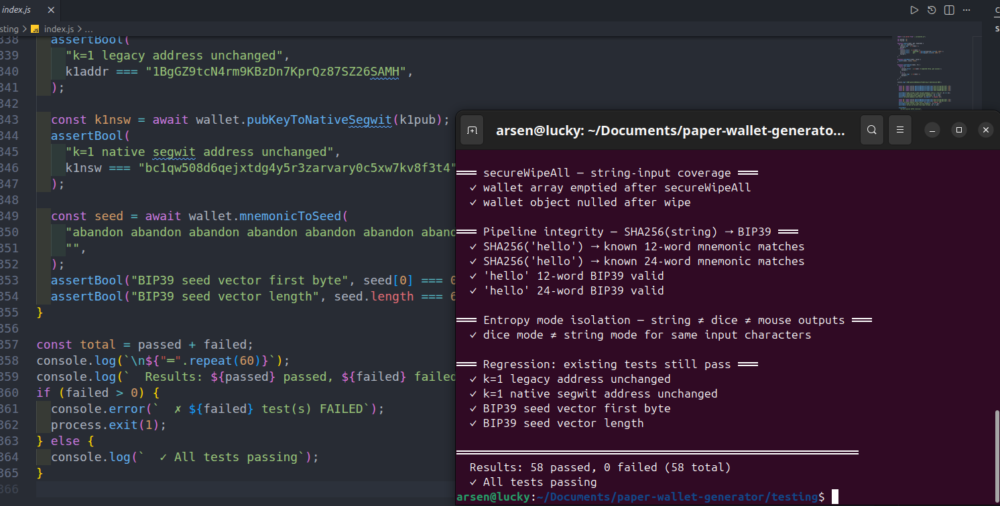


all BIP49 and BIP84 vectors were independently verified against Ian Coleman's BIP39 tool (`iancoleman.io/bip39`) running offline

### running tests requires Node.js

```bash
node --version   # v18+ recommended (needs native ES modules + BigInt)
cd testing
node index.js
```

the test runner shims browser APIs (`crypto.subtle`, `navigator`, `document`) to run the same `wallet.js` that ships in production - no separate test build

---

## Bug History and Fixes

A detailed record of every issue found, audited, and resolved during development.

### [FIX] secp256k1 parameter name shadowing (`Cannot mix BigInt and other types`)

**Symptom:** The Tools → Key Converter and wallet generation both failed with `TypeError: Cannot mix BigInt and other types, use explicit conversions`.

**Root cause:** The curve prime constant was renamed from `SECP256K1_P` to the shorter `P` for readability. However, `pointAdd(P, Q)` used `P` as the parameter name for the first point argument. Inside the function, references to the curve prime `P` in `modInverse(2n * py, P)` and `modInverse(qx - px, P)` were actually resolving to the point array `[x, y]`, not the BigInt prime. Passing an array to `modInverse` caused JavaScript to attempt BigInt arithmetic on a non-BigInt, throwing the type error.

**Fix:** Renamed function parameters to `pt1`/`pt2` (in `pointAdd`) and `pt` (in `pointMul`) to eliminate the shadowing:

```javascript
// Before - P shadows the curve constant inside the function body:
function pointAdd(P, Q) {
  ...
  const m = modP(3n * px * px * modInverse(2n * py, P)); // P = [x,y] array ← WRONG
}

// After - pt1/pt2 cannot shadow the module-level P constant:
function pointAdd(pt1, pt2) {
  ...
  const m = modP(3n * px * px * modInverse(2n * py, P)); // P = curve prime ✓
}
```

---

### [FIX] `validateRoundTrip` WIF decode padding (`padStart(74)` → `padStart(76)`)

**Root cause:** A compressed WIF encodes 38 bytes: `0x80 + 32-byte-key + 0x01 + 4-byte-checksum`. That is 76 hex characters. The original code used `padStart(74)` which would produce 37 bytes instead of 38. In practice the bug was dormant because the `0x80` version byte means the decoded BigInt is always large enough that its hex representation is already 76 chars - `padStart(74)` was a no-op. Nonetheless the logic was wrong.

**Fix:** Changed to `padStart(76)` and added an explicit `buf38` alignment step with version byte verification:

```javascript
const hexStr = num.toString(16).padStart(76, "0"); // was padStart(74)
const decoded = hexToBytes(hexStr.length % 2 ? "0" + hexStr : hexStr);
const buf38 = new Uint8Array(38);
buf38.set(decoded.slice(Math.max(0, decoded.length - 38)));
if (buf38[0] !== 0x80) {
  errors.push("WIF version byte invalid");
  return { valid: false, errors };
}
const keyBytes = buf38.slice(1, 33);
```

---

### [FIX] QR codes blank on first render (ID collision / timing race)

**Root cause:** The original implementation used `document.getElementById("qr-addr-" + i)` to find canvas elements after setting `innerHTML`. In multi-wallet batches, sequential numeric IDs could collide. More critically, the `getElementById` call happened before the DOM had fully parsed the injected HTML, producing `null` references and silently skipping the QR render.

**Fix:** Canvas elements are now created as live JavaScript objects before `innerHTML` is set. They are inserted into their slots via `appendChild` on direct DOM references - no `getElementById` involved, no timing dependency:

```javascript
const addrCanvas = document.createElement("canvas");
const privCanvas = document.createElement("canvas");
const div = document.createElement("div");
div.innerHTML = `...<div data-qr="addr"></div>...`;
div.querySelector('[data-qr="addr"]').appendChild(addrCanvas);
renderQR(w.address, addrCanvas, 160); // canvas is live - renders immediately
```

---

### [FIX] Dice mode: duplicate mnemonics when generating multiple wallets

**Root cause:** When generating N wallets in dice mode, the same `diceString` produced the same dice entropy on every iteration. If the fresh `crypto.getRandomValues()` call somehow produced identical bytes across calls (astronomically unlikely but theoretically possible), two wallets could share a mnemonic.

**Fix:** A `walletIndex` parameter is SHA-256 mixed into the entropy. The per-wallet nonce makes each derivation provably distinct regardless of CSPRNG output:

```javascript
// SHA-256(csprng ‖ diceBytes ‖ walletIndex)
// walletIndex is encoded as 4-byte big-endian uint
const combined = new Uint8Array(strength + strength + 4);
combined.set(csrng, 0);
combined.set(dice.slice(0, strength), strength);
combined.set(indexBuf, strength * 2);
```

---

### [FIX] Mouse entropy not wired to generation

**Root cause:** Mouse movement events were collected but the `mouseEntropySamples` array was never passed to `generateMnemonic()`.

**Fix:** The array is serialized to a `Uint8Array` and passed as `extraEntropy` to `generateMnemonic()`, which mixes it into the CSPRNG output via SHA-256:

```javascript
const extraBytes = new Uint8Array(mouseEntropySamples.length * 4);
mouseEntropySamples.forEach((s, i) => {
  new DataView(extraBytes.buffer).setUint32(i * 4, s >>> 0, false);
});
mnemonic = await generateMnemonic(wordCount === 24 ? 256 : 128, extraBytes);
```

---

### [FIX] Roll-for-me dice formatter: wrong line width

**Root cause:** The simulated roll formatter used `rolls.slice(i, i + 31)` - formatting 31 rolls per line instead of 10.

**Fix:** Changed to `rolls.slice(i, i + 10)`.

---

### [FIX] Copy to clipboard on `file://` origins

**Root cause:** `navigator.clipboard.writeText()` is restricted on `file://` origins in some browsers/OS combinations (requires a secure context with a loaded origin). Users who opened `index.html` directly saw copy buttons silently fail.

**Fix:** Added `execCommand("copy")` fallback:

```javascript
async function copyText(text, btn) {
  try {
    if (navigator.clipboard && navigator.clipboard.writeText) {
      await navigator.clipboard.writeText(text);
    } else {
      // Works on file:// and older browsers
      const ta = document.createElement("textarea");
      ta.value = text;
      ta.style.cssText = "position:fixed;top:0;left:0;opacity:0;pointer-events:none;";
      document.body.appendChild(ta);
      ta.focus(); ta.select();
      document.execCommand("copy");
      document.body.removeChild(ta);
    }
    ...
  }
}
```

---

### [FIX] BIP32 missing invalid-child-key guard

**Root cause:** BIP32 specifies that if the derived `IL ≥ n` (curve order) or `childKey = 0`, that index is cryptographically invalid. The original code did not check for these conditions, potentially (probability ~1/2¹²⁷) producing an invalid key silently.

**Fix:** Explicit checks added to `deriveChild()`:

```javascript
const ILint = bytesToBigInt(IL);
if (ILint >= N)
  throw new Error("BIP32: derived key IL >= N (invalid, astronomically rare)");
const childKey = (ILint + bytesToBigInt(parentKey)) % N;
if (childKey === 0n)
  throw new Error(
    "BIP32: derived child key is zero (invalid, astronomically rare)",
  );
```

---

### [AUDIT] P2SH address generation - confirmed correct

**Concern raised:** Possible incorrect P2SH-SegWit (BIP49) address derivation.

**Audit result:** The implementation produces correct BIP141 P2SH-P2WPKH addresses. Verified against Ian Coleman's reference tool for the standard `abandon × 11 + about` test vector:

```
mnemonic:  abandon abandon ... abandon about  (12 words, no passphrase)
path:      m/49'/0'/0'/0/0
expected:  37VucYSaXLCAsxYyAPfbSi9eh4iEcbShgf
actual:    37VucYSaXLCAsxYyAPfbSi9eh4iEcbShgf  ✓
```

Test added to suite.

---

### [AUDIT] BIP84 Native SegWit derivation - verified

**Audit:** BIP84 derivation verified against Ian Coleman reference:

```
mnemonic:  abandon abandon ... abandon about  (12 words, no passphrase)
path:      m/84'/0'/0'/0/0
expected:  bc1qcr8te4kr609gcawutmrza0j4xv80jy8z306fyu
actual:    bc1qcr8te4kr609gcawutmrza0j4xv80jy8z306fyu  ✓
```

Test added to suite.

---

### [AUDIT] Memory security documentation corrected

Earlier versions labelled the wipe button "Wipe All" and implied it zeroed memory. This was inaccurate for JavaScript strings. Documentation and button label corrected to "Clear from screen" with honest explanation of V8 string immutability. `Uint8Array.fill(0)` paths (seed bytes, key bytes stored as typed arrays) remain genuinely effective.

---

## Safe Usage

### Recommended environment

```
Best:     Air-gapped machine - never connected to internet
          Put repo on USB drive, open index.html

Good:     Live OS (Tails, Ubuntu Live USB)
          No persistent storage -> no surviving malware

Minimum:  Your regular machine
          Disconnect ALL network interfaces
          Close all other browser tabs
          Disable browser extensions
```

### Before funding any wallet

```
 CRITICAL: Always test before committing real funds.

1. Import the receiving ADDRESS (not private key) into a
   watch-only wallet (Electrum, Sparrow, Blockstream Green)

2. Send a small test amount (e.g. 0.00001 BTC)

3. Confirm arrival in the watch-only wallet

4. Only then send the full amount

This proves the address is valid and that you correctly
recorded the seed phrase before real funds are at risk.
```

### Printing checklist

- Printer is USB-connected (not WiFi, not cloud/Google Cloud Print)
- No one can see your screen while keys are displayed
- Print on plain paper (not thermal - fades within months)
- Fold on the dashed line so private key faces inward
- Seal with tape
- Store multiple copies in separate physical locations (fireproof safe, safety deposit box)

### Critical warnings

```
NEVER enter your private key or seed phrase into:
  • Any website, including "wallet checker" or "balance checker" sites
  • Any app you have not personally audited
  • Cloud storage, notes apps, email, or messaging services

NEVER photograph your seed phrase with:
  • A smartphone (auto-uploads to cloud backup)
  • Any internet-connected device

The seed phrase alone recovers EVERYTHING.
Whoever has it, owns the funds. Treat it like physical cash.
```

---

## Browser Compatibility

| Browser | Version | Status                   |
| ------- | ------- | ------------------------ |
| Chrome  | 90+     | ✅ Recommended           |
| Brave   | 1.0+    | ✅ Recommended (privacy) |
| Firefox | 89+     | ✅                       |
| Safari  | 15+     | ✅                       |
| Edge    | 90+     | ✅                       |

**Requires:** Web Crypto API (`crypto.subtle`) - available in all modern browsers.  
**Does not require:** Node.js, npm, any server, internet connection.

---

## License

MIT - use freely, audit thoroughly, trust minimally

---

## Contributing

Found a bug? Open an issue.  
Want to audit the cryptography? Everything is in `js/wallet.js` - no abstractions hiding anything.

---

```
    "Not your keys, not your coins."
                           - Bitcoin proverb

    This tool gives you your keys.
    What you do with them is your responsibility.
```
